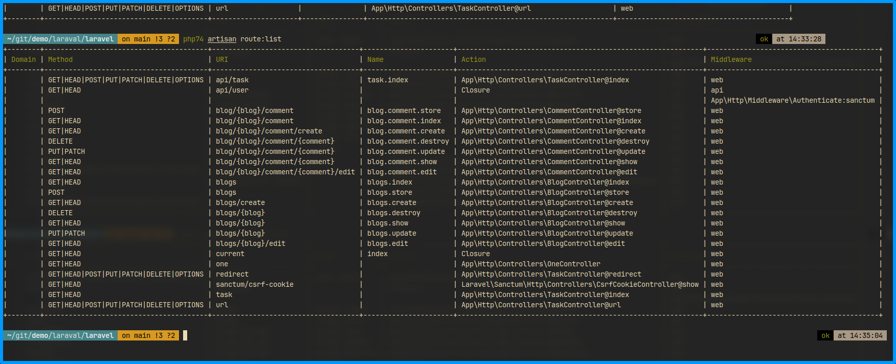
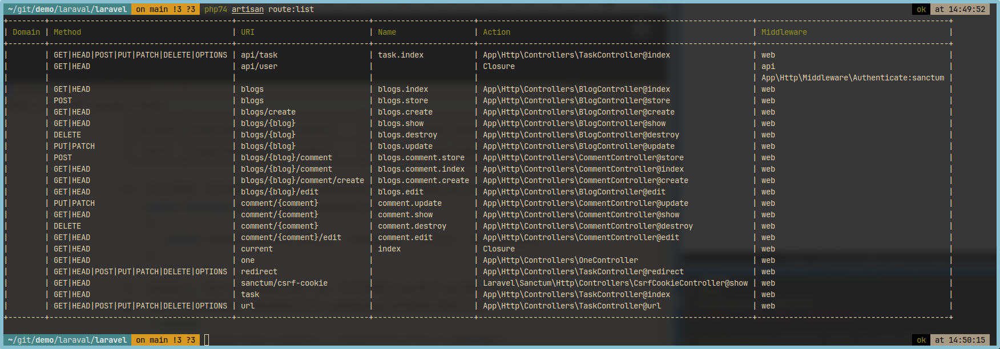
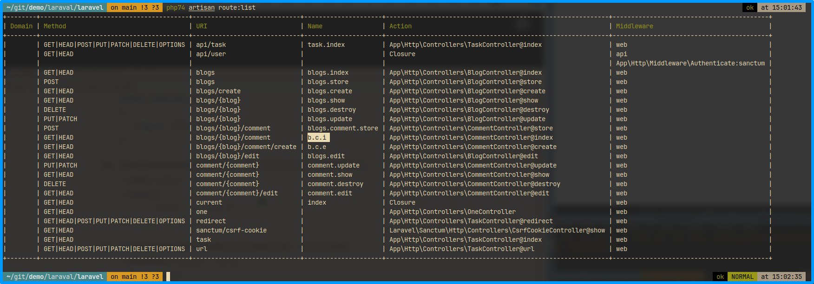
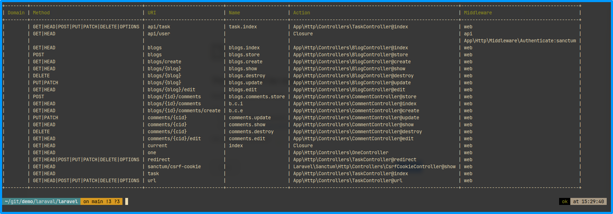
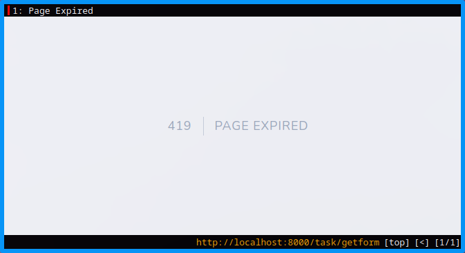
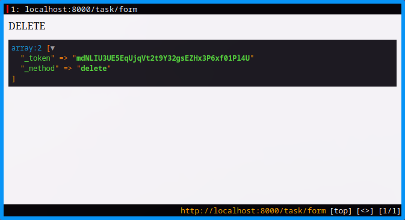
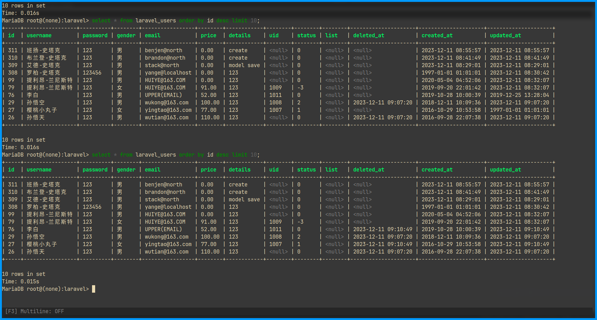

# 安装和配置
## 环境要求
- php 7.4 +
- composer
## 安装
1. 安装
    ```shell
    composer create-project --prefer-dist laravel/laravel laravel
    ```
1. 运行
    ```shell
    php artisan serve
    ```

# 路由的定义和控制器
## 路由的定义
路由是提供接受http请求的路径,并和程序交互的功能    
### 创建路由
```php
//routes/web.php
Route::get('index',function(){
    return 'Hello,World!';
})
```
### 提交接受方式
- ::get
- ::post()
- ::put()
- ::delete()
- ::put()
- ::any()
- ::match()
    ```php
    Route::match(['get','post'],'index',function(){

    })
    ```
### 传递路由参数
```php
Route::get('user/{id}'),function($id){
    return 'Id:'.$id;
});
```

## 控制器的路由
### 控制器的创建
- artisan命令
    ```shell
    php artisan make:controller TaskController
    ```
- IDE或者手动创建
    ```php
    //TaskController.php
    namespace App\Http\Controllers;
    class TaskController extends Controller{
        ...
    }
    ```

### 配置控制器路由
#### 普通路由
```php
//  /routes/web.php
Route::get('task',[App\Controller\TaskController::class,'index']);
```
```php
//TaskController.php
namespace App\Http\Controllers;
class TaskController extends Controller{
    public function index(){
        echo "<h1>Task->index()</h1>";
    }
}
```
#### 带参数路由
```php
//  /routes/web.php
Route::get('task',[App\Controller\TaskController::class,'index']);
Route::get('task/{id}',[App\Controller\TaskController::class,'showId']);
```
```php
//TaskController.php
namespace App\Http\Controllers;
class TaskController extends Controller{
    ...
    public function showId($id){
        return "ID:".$id;
    }
}
```
### 路由的参数
#### 普通传参
```php
//  /routes/web.php
Route::get('task',[App\Controller\TaskController::class,'read']);
```
```php
//TaskController.php
namespace App\Http\Controllers;
class TaskController extends Controller{
    ...
    public function read($id){
        retrun "ID:".$id;
    }
}
```
#### 参数约束
如果要对参数进行约束,可以使用与此同时来限定参数类型
- 单个参数
    ```php
    //  /routes/web.php
    Route::get('task/{id}',[App\Controller\TaskController::class,'read'])
            ->where('id','[0-9]+');
    ```
- 多个参数
    ```php
    //  /routes/web.php
    Route::get('task/{id}',[App\Controller\TaskController::class,'read'])
            ->where([
                'id'=>'[0-9]+',
                'name' => '[a-z]+'
                ]);
    ```
- 全局约束
    ```php
    //  /app/Providers/RouteServiceProvider.php
    public function boot(){
        Route::pattern('id','[0-9]+');
        parent::boot();
    }
    ```
- 局部解除约束
    ```php
    //  /routes/web.php
    Route::get('task/{id}',[App\Controller\TaskController::class,'read'])
            ->where('id','.*');
    ```


### 路由的重定向
#### redirect()
1. 普通重定向
    ```php
    //  /routes/web.php
    Route::redirect('index','task');
    ```
1.  带状态码重定向
    ```php
    //  /routes/web.php
    Route::redirect('index','task',301);
    ```

#### 301重定向
```php
Route::permanentRedirect('index','task');
```
### 视图路由
视图路由中,有三个参数可选:1.URI(必) 2.名称(必) 3.参数(选)

- view路由
    ```php
    // /routes/web.php
    // URI          /Task
    // 视图名称     task(/resources/views/task.blade.php)
    // 参数         {{$id}}
    Route::view('task','task',['id'=>10]);
    ```
- 使用助手函数
    ```php
    Route::get('task',function(){
        return view('task',['id'=>10]);
    });
    ```
- 控制器视图
    ```php
    // /routes/web.php
    Route::get('task',[\app\Http\Controller\TaskController::class,'index']);
    ```
    ```php
    // TaskController.php
    publicf function index(){
        retrun view('task',['id'=>10]);
    }
    ```
### 路由命名
为路由进行命名,可以生成URL地址或者进行重定向
1. 命名路由
    ```php
    Route::get('task',[\app\Http\Controller\TaskController::class,'index'])->name('task.index');
    ```
1. 助手函数生成URL
    - 使用方法
        ```php
        // http://127.0.0.1:8000/task
        route('task.index');
        ```
    - 额外参数    
        第二个参数为生成的URL参数,第三个参数为是否包含域名
        ```php
        // /task?id=10
        route('task.index',['id'=>10],false);
        ```
1. 重定向生成的url
    ```php
        return redirect()->route('task.index',['id'=10]);
    ```
    ```php
        return redirect(route('task.index',['id'=10]));
    ```
### 路由分组
路由分组可以让大量路由共享路由属性,包括中间件、命名空间等
#### 空的分组
```php
Route::group(['prefix'=>'api'],function(){
});
```
#### 中间件
1. 数组方式
    ```php
    Route::group(['middleware'=>'中间件名'],function(){
    })
    ```;
1. 链式
    ```php
    Route::middleware(['中间件名'])->group(['prefix'=>'api'],function(){
    });
    ```
#### 路由前缀
    1. 数组方式
    ```php
    Route::group(['prefix'=>'api'],function(){
        Route::get('task',[\app\Http\Controller\TaskController::class,'index']);
    });
    ```
    1. 链式
    ```php
    Route::prifix('api')->group(['prefix'=>'api'],function(){
        Route::get('task',[\app\Http\Controller\TaskController::class,'index']);
    });
    ```
#### 子域名
1. 数组方式
    ```php
    Route::group(['domain'=>"127.0.0.1"],function(){
    });
    ```
1. 链式
    ```php
    Route::domain('127.0.0.1')->group(function(){
    });
    ```
#### 命名空间
1. 数组方式
    ```php
    Route::group(['namespace'=>'Admin'],function(){
    });
    ```
1. 链式
    ```php
    Route::namespace('Admin')->group(function(){
    });
    ```
#### 名称前缀
1. 数组方式
    ```php
    Route::group(['as'=>'admin.'],function(){
        Route::get('/',[Admin::class,'index'])->name('index');
    };
    ```
1. 链式
    ```php
    Route::name('admin.')->group(function(){
    });
    ```
1. 嵌套方式
    ```php
    Route::name('admin')->group(function(){
        Route::name('user')->group(function(){
        });
    });
    ```

### 单行为控制器
如果定义一个只执行一个方法的控制器,可以使用单行为控制器
> 单行为控制器不需要指定方法    
> 单行为控制器只是主义上的单行为,并没有限制创建更多的方法访问    

#### 创建
1. 命令行创建
    ```shell
    php artisan make:controller OneController --invokable
    ```
1. IDE或者手工创建
    ```php
    class OneController extends Controller{
        public function __invoke(){
            return '单行为控制器';
        }
    }
    ```
#### 使用
    ```php
    Route::get('one','\App\Http\Controllers\OneController');
    ```

### 路由回退
如果跳转到一个不存在的路由时,会产生404错误,可以使用回退路由,让不存在的路由自动跳转到指定的页面.
> 注意:由于执行顺序问题,必须把回退路由放在所有路由的最底部     

```php
Route::fallback(function(){
    return redirect('/404');
})
```
```php
Route::fallback(function(){
    return view('404');
})
```

### 当前路由
可以使用::current()方法,获取当前路由的信息
```php
Route::get('index',function(){
    //当前路由信息
    dump(Route::current());
    //返回当前路由名称
    return Route::currentRouteName();
    //返回肖前路由指向方法
    return Route::currentRouteAction();
})->name('index');
```

### 响应设置
路由和控制器处理完业务都会返回一个发送到浏览器的响应:return.    
字符串会直接输出,而数组会输出json格式,本身是response对象.
#### response()输出
```php
return respose('index',201);
```
#### 修改http标头
```php
return respose('<b>index</b>')
    ->header('Content-Type','text/plain');
```
#### 显示纯html代码
```php
return respose()->view('task',['id'=>10],201)
    ->header('Content-Type','text/plain');
```
### 路由重定向
重定向需要return才能跳转
1. 助手函数
    ```php
    return redirect()->to('/');
    return redirect('task');    //快捷方式
    ```
1. facade门面模式
    ```php
    return redirect::to('task');
    ```
1. 结合route方法,跳转到命名路由
    ```php
    return redirect()->route('task.index');
    ```
1. 重定向到上一个页面
    ```php
    return redirect()->back();
    return back()               //快捷方式
    ```
1. 重定向到控制器的方法
    ```php
    return redirect()->action([\App\Http\Controllers\TaskController::class,'index']);
    ```
    > 需要首先注册路由
1. 重定向到外部链接
    ```php
    return redirect()->away('https://www.liuxinyang.com.cn');
    ```
    > 不会携带任务编码

## 资源控制器
### 资源控制器的定义
专门处理curd的控制器,不需要设置大量路由,有固定的方法名
### 创建资源控制器
```shell
php artisan make:controller BlogController --resource
```
### 配置资源控制器的路由
1. 配置路由
```php
Route::resource('blogs','BlogController');
```
1. 批量配置
```php
Route::resources([
    'blogs'=>'BlogController',
]);
```
### 资源控制器的7种方法

| http类型  | 路由uri           | 控制器方法 | 路由命名      | 描述                 |
|-----------|-------------------|------------|---------------|----------------------|
| GET       | blogs             | index()    | blogs.index   | 获取数据列表         |
| GET       | blogs/create      | create()   | blogs.create  | 创建页面(表单页)     |
| POST      | blogs             | store()    | blogs.store   | 创建页的接受处理     |
| GET       | blogs/{blog}      | show()     | blogs.show    | 获取一条数据         |
| GET       | blogs/{blog}/edit | edit()     | blogs.edit    | 编辑一条数据(表单面) |
| PUT/PATCH | blogs/{blog}      | update()   | blogs.update  | 数据编辑页的接受处理 |
| DELETE    | blogs/{blog}      | destroy()  | blogs.destroy | 删除一条数据         |

> URI和名称会自动创建

> 使用artisan命令可以查看可用路由
```shell
php artisan route:list
```

### 限制路由方法
1. 限制方法
    ```php
    Route::resource('blogs','\App\Http\Controllers\BlogController')
        ->only(['index','show']);
    ```
1. 排除方法
    ```php
    Route::resource('blogs','\App\Http\Controllers\BlogController')
        ->except(['index','show']);
    ```

### API资源路由
只提供数据接口不包含html方法资源控制器
1. 生成API资源控制器    
    ```shell
    php artisan make:controller CommentController --api
    ```
1. 配置路由
    ```php
    Route::apiResource('blogs','\App\Http\Controllers\BlogController');
    ```
1. 批量配置
    ```php
    Route::apiResources([
        'blogs'=>'\App\Http\Controllers\BlogController'
    ]);
    ```
1. API资源路由可用方法    

    | http类型  | 路由uri      | 控制器方法 | 路由命名      | 描述                 |
    |-----------|--------------|------------|---------------|----------------------|
    | GET       | blogs        | index()    | blogs.index   | 获取数据列表         |
    | POST      | blogs        | store()    | blogs.store   | 创建页的接受处理     |
    | GET       | blogs/{blog} | show()     | blogs.show    | 获取一条数据         |
    | PUT/PATCH | blogs/{blog} | update()   | blogs.update  | 数据编辑页的接受处理 |
    | DELETE    | blogs/{blog} | destroy()  | blogs.destroy | 删除一条数据         |

### 资源嵌套
1. 生成资源控制器
    ```shell
    php artisan make:controller CommentController --resource
    ```
1. 配置资源嵌套路由
    ```php
    Route::apiResource('blogs.comments','\App\Http\Controllers\CommentController');
    ```
    

1. 控制器获取参数    
    根据路由地址可以得知,在url可以获取两个参数
    ```php
    public function edit($blog_id,$comment_id){
        return 'Blog_id:'.$blog_id."\tComment_id:".$comment_id;
    }
    ```
1. 浅嵌套    
    为优化嵌套方法,可以通过路由方法shallow()实现浅嵌套
    ```php
    Route::apiResource('blogs.comments','\App\Http\Controllers\CommentController')->shallow();
    ```
    
1. 自定义资源路由名称
    - 单一更改
        ```php
        Route::apiResource('blogs.comments','\App\Http\Controllers\CommentController')
            ->shallow()
            ->name('index','b.c.i');
        ```
    - 批量更改
        ```php
        Route::apiResource('blogs.comments','\App\Http\Controllers\CommentController')
            ->shallow()
            ->names([
                'index'=>'b.c.i',
                'create'=>'b,c,c'
            ]);
        ```
        
1. 更改路由参数名称
    - 单一更改
        ```php
        Route::apiResource('blogs.comments','\App\Http\Controllers\CommentController')
            ->shallow()
            ->paramenter('blogs','id');
        ```
    - 批量更改
        ```php
        Route::apiResource('blogs.comments','\App\Http\Controllers\CommentController')
            ->shallow()
            ->paramenters([
                'blogs'=>'id',
                'comments'=>'cid'
            ]);
        ```
        

## 表单伪造和CSRF保护
### 表单伪造
1. 创建请求方法
    ```php
    // TaskController.php
    public function form(){
        return view('form');
    }
    ```
    ```html
    <form action="/task/getform" method="post">
        <button type="submit">提交</button>
        </form>
    ```

1. 创建接收路由
    ```php
    //  表单页
    Route::get('task/form',[\App\Http\Controllers\TaskController::class,'form']);
    //  接收页
    Route::any('task/getform',function(){
        return \Illuminate\Support\Facades\Request::method();
    });
    ```
    > 为避免被跨站伪造请求攻击,框架提供了CSRF令牌保护,如果以POST提交,会出现410错误

    
1. 添加令牌信息
    ```html
    <input type="hidden" name="_token" value="{{csrf_token}}">
    ```
1. 表单伪造
    ```html
    <input type="hidden" name="_method" value="PUT">
   ``` 
1. 快捷方式
    ```html
    <form action="/task/form" method="post">
        @csrf
        @method('delete')
        <button type="submit">提交</button>
    </form>
    ```
    
1. csrf白名单
    ```php
    // /app/Http/Middleware/VerifyCsrfToken.php
    // 所有/api下的访问,不需要token令牌
    protected $except=[
        '/api/*',
    ]
    ```

# 数据库
> laravel支持原生、查询构造器及Eloquent ORM(关系型对象映射器)来操作数据库.

## 配置数据库
> 数据库配置在/config/database.php文件,本地开发环境可以直接配置.env文件

1. 本地开发环境 
    ```php
    // /.env
    DB_CONNECTION=mysql
    DB_HOST=127.0.0.1
    DB_PORT=3306
    DB_DATABASE=laravel
    DB_USERNAME=root
    DB_PASSWORD=
    ```
1. 线上环境
    ```php
    // /config/database.php
    'mysql' => [
        'driver' => 'mysql',
        'url' => env('DATABASE_URL'),
        'host' => env('DB_HOST', '127.0.0.1'),
        'port' => env('DB_PORT', '3306'),
        'database' => env('DB_DATABASE', 'forge'),
        'username' => env('DB_USERNAME', 'forge'),
        'password' => env('DB_PASSWORD', ''),
        'unix_socket' => env('DB_SOCKET', ''),
        'charset' => 'utf8mb4',
        'collation' => 'utf8mb4_unicode_ci',
        'prefix' => '',
        'prefix_indexes' => true,
        'strict' => true,
        'engine' => null,
        'options' => extension_loaded('pdo_mysql') ? array_filter([
            PDO::MYSQL_ATTR_SSL_CA => env('MYSQL_ATTR_SSL_CA'),
        ]) : [],
    ],
    ```

## 数据库查询
1. 原生查询
    ```php
    $user = DB::select('SELECT * FROM laravel_users');
    return $user;
    ```
1. 构造器查询
    ```php
    $user = DB::table('laraval_users')->find(19);
    return $user;
    ```
1. 模型查询
    - 新建模型
    ```shell
    php artisan make:model Http/Models/User
    ```
    - 修改数据表前缀
    ```php
    // /config/database.php
    'mysql' => [
        ...
        'prefix' => 'laravel_',
        ...
    ],
    ```
    - 查询
    ```php
    use App\Http\Models\User;
    $user = User::all();
    ```
    - 关于数据表的复数    
    由于模型的编码规范要求数据表是复数,可以使用字符串助手来判断英文单词的复数情况
    ```php
    use Illuminate\Support\Str;

    return Str::plural('bus');          //buses
    return Str::plural('user');         //users    
    return Str::plural('child');        //children
    ```
    也强制使用现有数据表名
    ```php
    protected $table = 'user';
    ```

## 构造器
### 查询
- table()    
    引用相应的数据表
    ```php
    $user = DB::table('users');
    ```

- get()    
    查询当前表所有数据
    ```php
    $user = DB::table('users')->get();
    ```

- first()    
    查询第一条数据
    ```php
    $user = DB::table('users')->first();
    ```

- value(字段名)    
    获取到第一条数据的字段值
    ```php
    $user = DB::table('users')->value('email');
    $user = DB::table('users')->where('id',20)->value('email');
    ```

- find()    
    获取指定id的一条数据
    ```php
    $user = DB::table('users')->find(20);
    ```

- pluck(字段名)    
    获取所有数据单列值的集合
    ```php
    //获取所有用户的email
    $user = DB::table('users')->pluck('email');
    //第二个参数可以做为输出集合的key
    $user = DB::table('users')->pluck('username','id');
    ```

### 分块查询
如果查询数据记录较大,可以使用chunk()方法分块
```php
$users = DB::table('users')->orderBy('id')->chunk(3,function($users){
    foreach($users as $user){
        echo $user->username."\t";
    }
    echo "<hr>";
});
```

### 聚合查询    
- count()    
    计算查询总数
    ```php
    return DB::table('users')->count();
    ```
- max()/min()    
    查询最大值/最小值
    ```php
    return DB::table('users')->max('price');
    ```
- avg()    
    查询平均值
    ```php
    return DB::table('users')->avg('age');
    ```
- sum()    
    求和
    ```php
    return DB::table('users')->sum('price');
    ```

### 判断是否存在
```php
return DB::table('users')->where('id',20)->exists();
return DB::table('users')->where('id',20)->doesntexists();
```
### 查询表达式
#### select查询
1. select()   
    可以定制想要的字段,而不是所有字段
    ```php
    $users = DB::table('users')->select('username as name','email')->get();
    ```
1. addSelect()    
    在原查询的基础上增加想要显示的字段
    ```php
    $base = DB::table('users')->select('username as name','email');
    $users = $base->addSelect('gender')->get();
    ```
1. DB::raw()    
    可以在select()内部实现原生表达式,从而实现复杂查询
    ```php
    $users = DB::table('users')->select(DB::raw('COUNT(*) AS count,gender'))
        ->groupBy('gender')
        ->get();
    ```
1. selectRaw()    
    同上
    ```php
    $users = DB::table('users')->selectRaw('COUNT(*) as count,gender')
        ->groupBy('gender')
        ->get();
    ```
1. havingRaw()
    在分级后实现筛选
    ```php
    $users = DB::table('users')->selectRaw('COUNT(*) as count,gender')
        ->groupBy('gender')
        ->havingRaw('count > 5')
        ->get();
    ```

#### where查询

#### 子查询

#### join查询
1. join查询
    ```php  
    $user= DB::table('users')
        ->join('books','users.id','=','books.id')
        ->join('profiles','user.id','=','profiles.user_id')
        ->select('user.id','users.name','user.email','books.title','profiles.hobby')
        ->get();
    ```

### 新增
1. insert()
    - 新增一条记录
        ```php
        DB::table('users')->insert([
            'username'=>'洋哥',
            'email'=>'yange@localhost',
            'password' => '123456',
            'details' => '123'
        ]);
        ```
    - 新增多条记录
        ```php
        DB::table('users')->insert([
            [...],
            [...]
        ]);
        ```
1. insertOrIgnore()    
当插入数据有错误时,可以忽略错误
    ```php
    DB::table('users')->insertOrIgnore([
        // id10数据已存在
        'id' => 20,
        'username'=>'洋哥',
        'email'=>'yange@localhost',
        'password' => '123456',
        'details' => '123'
    ]);
    ```
1. insertGetId()    
获取新增后的id
    ```php
    $id = DB::table('users')->insertGetId([
        'username'=>'洋哥',
        'email'=>'yange@localhost',
        'password' => '123456',
        'details' => '123'
    ]);
    ```
### 修改
1. updata()    
通过条件更新一条数据
    ```php
    DB::table('users')->where('id',307)
        ->update([
            'username' => "洋嫂",
            'email' => 'yangsao@localhost'
        ]);
    ```
1. updataOrInsert()    
如果满足第一个参数就修改,不满足就为新增
    ```php
    $res = DB::table('users')->updateOrInsert(
        ['id'=>102],
        [
            'username'=>'洋妹',
            'password' => '123456',
            'email'=>'yangMM@localhost',
            'details'=>'updataOrinsert'
        ]);
    return $res;
    ```
1. json数据的修改
    ```php
    DB::table('users')->where('id',307)
        ->update([
            'list->id' => 20
        ]);
    ```
1. increment()/decrement()    
自增和自减,第二个参数可设置步进 
    ```php
    DB::table('users')->where('id',206)->increment('price');
    DB::table('users')->where('id',206)->increment('price',2);
    ```
### 删除
- delect()    
删除数据,如果不加where条件,会清空表
    ```php
    DB::table('user')->where('id',307)->delect();
    ```
- truncate()    
清空数据表
    ```php
    DB::table('user')->truncate();
    ```

## 模型
框架使用Eloquent ORM关系对象模型
### 模型基础
1. 创建模型
    ```shell
    php artisan make:model Http/Models/User
    ```
1. 表名默认遵循复数规则,也可以指定为特定表名
    ```php
    class User extends Model{
        protected $table = 'user';
    }
    ```
1. 系统假定主键为id,也可以指定默认主键
    ```php
    protected $primaryKey = "xid";
    ```

1. 如果使用非自增,非数值类型主键,可以设置取消
    > 系统假定主键id为自增貹,意味着主键会自动转换为int类型
    ```php
    public $incrementing = false;
    ```
1. 如果主键不是一个整数,那么需要设置$keyType设置string
    ```php
    protected $keyType='string';
    ```
1. 系统默认情况下会接管create_at和updated_at两个时间列,如果不想让系统干涉,可以设置false取消
    ```php
    public $timestamps = false;
    ```
1. 自定义时间戳格式,可以设置
    ```php
    protected $dataFormat = 'U';
    ```
1. 更改创建时间create_at和更新时间updated_at字段名
    ```php
    const CREATED_AT = 'create_time';
    const UPDATED_AT = 'update_time';
    ```
1. 默认读取database.php配置的数据库连接,也可以在模型端局部更改
    ```php
    protected $connection = 'mysql';
    ```
### 模式定义
- 模型和构造器的操作基本相同,如查询所有数据
    ```php
    $user = User::get();               //或者all() 
    return [$user];
    ```
- 可以像查询构造器一样,添加各种各样的条件
    ```php
    $user = User::where([
        ['gender','=','男'],
        ['price','>',95]
    ])->limit(2)->get();
    ```
- 模型没有代码提示,可以通过安装插件解决
    ```shell
    composer require barryvdh/laravel-ide-helper
    php artisan ide-helper:generate //为Facades生成注释
    php artisan ide-helper:model    //为Model生成注释
    php artisan ide-helper:meta     //生成phpStorm Meta file
    ```
- 查询方法
    1. find(1)      //通过主键查询
    1. first        //查询第一个结果
    1. firstWhere   //打到查询中的首个
    1. find[1,2,3]  //通过数组查找
    1. firstOr()    //查询首个返回,支持闭包
    1. firstOrFail()//查询不到时返回异常
### 模型新增和修改
1. save()    
    - 新增
    > 默认模型会接管created_at和updated_at
    ```php
    $user = new User();
    $user->username = '艾德-史塔克';
    $user->password = '123';
    $user->email='stack@north';
    $user->details = 'Model save';
    $user->save();
    ```
    - 更新
    在查找到一条数据的情况下,save()直接会更新数据
    ```php
    $user = User::find(321);
    $user->username='罗柏-史塔克';
    $user->save();
    ```
1. update()    
    批量更新
    ```php
    User::where('username','辉夜')
        ->update([
            'username'=>'提利昂-兰尼斯特',
        ]);
    ```
1. create()    
create()方法实现新增,需要在模型设置批量赋值许可
    ```php
    User::create([
        'username' => '布兰登-史塔克',
        'password' => '123',
        'email'     => 'brandon@north',
        'details'   => 'create'
    ]);
    ```
    ```php
    //User.php
    //设置填充许可
    protected $fillable = [
        'username','password','email','details'
    ];
    ```
        
### 模型的删除
1. delete()    
    ```php
    $users = User::find(321);
    $users->delete();
    ```
1. destroy()    
通过主键删除,可以使用destroy(id),免去查询操作
    ```php
    User::destroy(322);
    User::destroy([1,2,3]);
    ```

### 批量赋值
当批量处理前端发来的请求时,如果设置了$fillable以后,可以忽略掉多余的信息
```php
$request = [
    'username' => '班扬-史塔克',
    'password' => '123',
    'email'     => 'benjen@north',
    'details'   => 'create',
    'slogan'    => 'winner is comming',
    'age'       => '46'
];
User::create($request);
```

### 软删除
1. 在数据库创建一个字段为deleted_at,用于判断是否被软删除
    ```mysql
    ALTER TABLE laravel_users
    ADD COLUMN deleted_at default null;
    ```
1. 开启软删除
    ```php
    use SoftDeletes
    ```
1. 开启软删除后,删除操作会变成更新操作,给deleted_at赋值
    ```php
    $users = User::where('username','like','%孙悟%')->get();
    $users->delete();
    ```
    ```php
    User::destroy(76);
    ```
    
1. 开启软件删除后,正常的数据获取,会自动隐藏软件删除数据
1. 如要需要查询包含软删除的数据,通过withTrashed()方法实现
    ```php
    $users = User::withTrashed()->get();
    ```
    ```php
    //即使没有被软删除的数据也能查询到
    $user = User::withTrashed()->find(24);
    ```
1. 如果只想查询软删除数据,可以通过onlyTrashed()方法
    ```php
    $users = User::onlyTrashed()->get();
    ```
    ```php
    //只有软删除的数据才被查询到
    $user = User::onlyTrashed()->find('24');
    ```
1. 如果将软删除的数据恢复正常,使用restore()
    ```php
    $user = User::onlyTrashed()->find(24);
    $user->restore();
    ```
1. 开启了软删除,使用forceDelete()方法可以永久删除
    ```php
    $user = User::onlyTrashed()->find(24);
    $user->forceDelete();
    ```

### 模型的查询作用域
在数据查询时,被重复使用的一部分条件,可以用查询作用域来完成
1. 本地作用域    
    - 简单模式    
    查询条件性别为男
    ```php
    // User.php
    public function scopeGenderMale($query){
        $query->where('gender','男');
    }
    ```
    ```php
    $user = User::genderMale()->where('price','>',90)->get();
    ```
    - 参数模式
    ```php
    public function scopeGender($query,$gender){
        $query->where('gender',$gender)
    }


    


