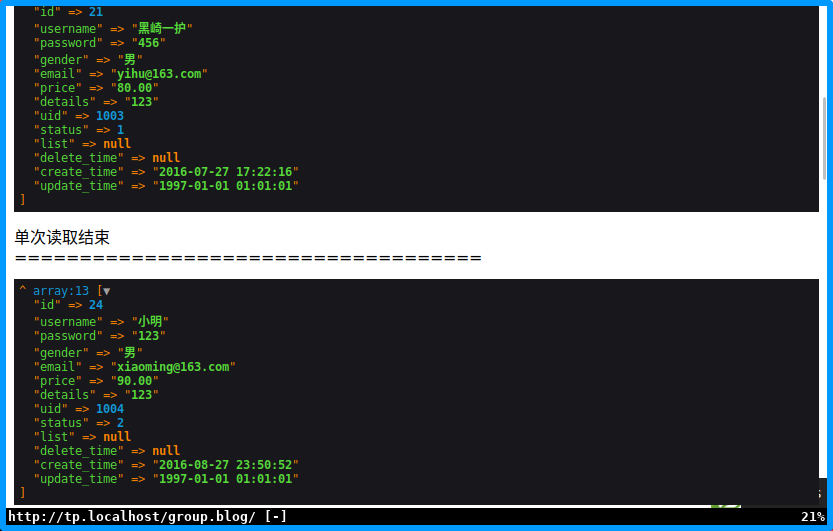
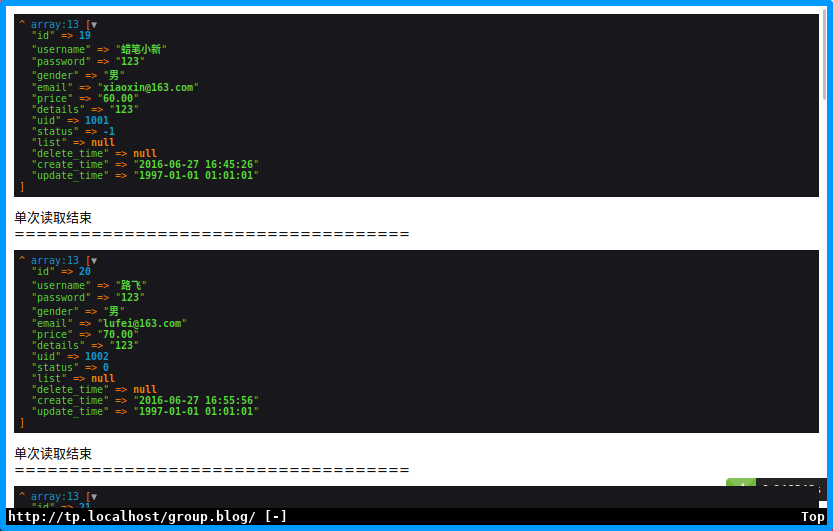

# thinkphp 6.0


## 开发规范及目录结构
### 命名规范
1. 遵循psr-2命名规范和psr-4自动加载
1. 目录和文件的命令规范
    - 目录名:小写+下划线
    - 类库和函数文件以.php为扩展名
    - 类的文件名均以空间定义,并且命名空间的路径和类库文件所在的路径一致
    - 类文件采用帕斯卡命名法(大驼峰),其它彩用小写+下划线命名
    - 类名和文件名操持一致,统一采用帕斯卡命名法
1. 函数和类及属性命名规范
    - 类的名称采用帕斯卡命名法,如:User UserType
    - 函数的命名采用下划线命名法,如:get_user_id;
    - 方法彩用驼峰法,如:getUserId;
    - 属性采用驼峰法,如:tableName;
    - 特例使用双划线\_\_打头函数或者方法作用魔术方法,如:\_\_call \_\_autoload;
1. 常量和配置的规范
    - 常量以大写字母和下划线命名,如APP_PATH;
    - 配置参数以小写字母和下划线命名,如:url_convert;
    - 环境变量定义全用大写字母和下划线,如:APP_DEBUG;
1. 数据表和字段的规范
    - 数据表和字段采用小写+下划线;
    - 字段不用驼峰和中文做为表名和字段名

### 目录结构
1. TP6支持多应用模式,app是应用目录
1. 默认情况下,彩用单模式,结构如下:
```shell
thinkphp
├── app
│   ├── AppService.php
│   ├── BaseController.php
│   ├── common.php
│   ├── controller
│   ├── event.php
│   ├── ExceptionHandle.php
│   ├── middleware.php
│   ├── provider.php
│   ├── Request.php
│   └── service.php
├── composer.json
├── composer.lock
├── config
│   ├── app.php
│   ├── cache.php
│   ├── console.php
│   ├── cookie.php
│   ├── database.php
│   ├── filesystem.php
│   ├── lang.php
│   ├── log.php
│   ├── middleware.php
│   ├── route.php
│   ├── session.php
│   ├── trace.php
│   └── view.php
├── extend
├── LICENSE.txt
├── log.md
├── public
│   ├── favicon.ico
│   ├── index.php
│   ├── robots.txt
│   ├── router.php
│   └── static
├── README.md
├── route
│   └── app.php
├── runtime
├── think
├── vendor
│   ├── autoload.php
│   ├── bin
│   ├── composer
│   ├── league
│   ├── psr
│   ├── services.php
│   ├── symfony
│   └── topthink
└── view
    └── README.md
```

## 安装及配置
### 安装
```shell
 composer create-project topthink/think=6 thinkphp
```
### nginx配置
```vim
// /etc/nginx/site-availabel/tp.localhost.conf
server { listen       80;
	server_name  tp.localhost;
	root   /www/thinkphp/public;
	location / {
	    index  index.html index.htm index.php;
	}
	error_page   500 502 503 504  /50x.html;
	location = /50x.html {
	    root   /usr/share/nginx/html;
	}
	include php74.conf;
```

### 测试命令
```shell
php think run 
```
### 调试模式
1. 复制.example.env为.env文件
```shell
cp .example.env .env
```
2. 将.env文件换行符替换为linux
```vim
// vim .env
// ^M为ctrl+v ctrl+m
:%s/^M/\r/g 
// 检查APP_DEBUG配置
APP_DEBUG = true
```

### 配置信息
1. /.env文件,用于本地配置,部署后会被忽略    
获取配置方式:
```php
use think\facade\Env;
return Env::get('databse.hostname');
```
1. /config文件,用于线上部署
获取配置方式:
```php
use think\facade\config
return Config::get('database.connections.mysql.hostname');
```
1. 本地环境.env文件的优先级会高于config,生产环境.env会被忽略

### url访问模式
1. url解析
    - 多应用: http://serverName/index.php/应用/控制器/操作/参数/值...;
    - 单应用: http://serverName/index.php/控制器/操作/参数/值...;
    - TP6默认是单应用模式,多应用需要作为扩展安装;
1. 兼容模式    
如果不支持url重写,可以用http://serverName/?r=控制器/操作/参数/值来访问.


## 控制器
### 控制器定义
控制器文件存放在controller目录下.
1. 如果改变系统默认的控制器文件目录,可以在config下的router.php配置,如:
```php
'conftoller_layer' => 'controller2',
```
1. 类名和文件名大小写要保持一致,帕斯卡命名
1. 双字母组合的类名,比如class Helloworld访问URL如下:
    - http://localhost/helloworld
    - http://localhost/hello_world
1. 为了避免引入同类名的冲突,可以在route.php设置控制器后缀,那么控制器的命名需要在类名后Controller,比如Test.php-->TestController.php:
```php
'controller_suffix' => true;
```
### 渲染输出
1. ThinkPHP直接采用方法内return的方式输出;
2. json输出,直接采用json函数:
```php
$data = array('a' => 1,'b' => 2,'c' =>3);
return json ($data);
```
3. 避免使用die exit等php方法中断代码,推荐使用助手函数halt();
```php
halt('中断测试');
```
### 基础  多级控制器
1. 基础控制器
    - 创建控制器后,推荐继承基础控制器来获得更多的方法;
    - 基础控制器提供了控制器验证功能,并注入了think\App和think\Request;
1. 空控制器    
在单应用模式下,可以定义一个Error控制器类,来提醒错误:
```php
class ErrorContoller{
    public function index(){
        return 'ErrorContoller:当前控制器不存在!';
    }
}
```
1. 多级控制器    
多级控制器就是在控制器controller目录下再建立目录并创建控制器,例:    
在controller目录建立group目录,并创建BlogController.php控制器,访问的地址为:http://localhost/group.blog
```php
namespace app\controller\group;
use app\BaseController;
class BlogController extends BaseController{
    public function index(){
        echo "group.blog.index";
    }
}
```

## 数据库与模型
### 连接数据库
1. ThinkPHP采用数据抽象层,基于PDO式
1. 修改/config/database.php可以设置连接信息
1. 本地测试,会优先采用.env的配置信息

### 数据库的数据查询
1. 单数据查询
    - Db::table()中table必须指定完整数据表名(包括前缀)
    - 如果希望只查询一条数据,可以使用find()方法,需要指定where条件:
    ```php
    Db::table(`tp_user`)->where('id',27)->find()
    ```
    - Db::getLastSql()方法,可以得到最近一条SQL查询的原生语句
    - 没有查询到任何值,返回null
    - 使用findOrFail()方法同样可以查询一条数据,在没有数据时抛出一个异常:
    ```php
    Db::table('tp_user')->where('id',1)->findOrFail()
    ```
    - 使用findOrEmpty()方法也可以查询一条数据,但在没有数据时返回一个空数组:
    ```php
    Db::table('tp_user')->where('id',1)->findOrEmpty()
    ```
1. 数据集查询
    - 想要获取多列数据,可以使用select()方法
    ```php
    Db::table('tp_user')->select();
    // SELECT * FROM `tp_user`;
    ```
    - 多列数据在查询不到任务数据时,返回空数组,使用selectOrFail()抛出异常:
    ```php
    Db::table('tp_user')0>where('id',1)->selectOrFail();
    ```
    - 在select()方法后使用toArray(),可以将数据集对象转换为数组
    ```php
    $user = Db::table('tp_user')->select->toArray();
    $halt($user);
    ```
    - 当在数据库配置文件中设置了前缀,可以使用name()方法忽略前缀:
    ```php
    Db::name('user')->where('id',27)->value('username');
    ```
1. 其它查询
    - 通过value()方法可以查询单个指定字段的值,没有数据返回null;
    ```php
    Db::name('user')->where('id',27)->value('username');
    ```
    - 通过colunm()方法可以查询多个指定字段的列,没有数据返回空数组:
    ```php
    Db::name('user')->column('username');
    //指定id做为列的索引
    Db::name('user')->column('username','id');
    ```
    - 处理大数据时,为避免内存处理大量数据,可以使用chunk()分批处理数据:
    ```php
    Db::name('user')->chunk(3,function($users){
      foreach($users as $user){
          dump($user);
      }
      echo "单次读取结束<br>";
      echo '====================================';
    });
    ```
    结果如下:    
    
    - 游标查询功能可以大幅度减少少量数据的内存开销,它利用了PHP生成器我,每次查询只读取一行,再次读取时,自动定位到下一行继续:
    ```php
    $cursor = Db::name('user')->cursor();
    foreach($cursor as $user){
        dump($user);
    }
    ```
    结果如下:    
    
1. 链式查询
    1. 查询规则
        - 通过指向符号'->'多次连续调用方法称为:链式查询    
        当通过Db::name('user')查询时,返回一个Query对象,可以连续使用数据库对应方法.当每次执行一个数据库查询方法时,比如(where),返回的还是查询对象,只要是数据库对象,那么可以一直使用指向符号进行链式查询.
        - 当通过find()select()等结果查询方法返回数组(Array)或者数据集对象(Colletigon)时,不可再使用链式查询
        - 除了查询方法可以使用链式操作,CURD也可以使用
    1. 更多查询   
        - 如果多次使用数据库查询,篛次静态创建都会生成一个对象,我们可以把对象实例保存下来,再进行反复调用即可
        ```php
        $userQuery = Db::name('user');
        $dataFind = $userQuery->where('id',27)->find();
        $dateSelect = $userQuery->select();
        ```
        - 当同一个对象实例第二次查询后,会保留第一次查询的值
        ```php
        $data1 = $userQuery->order('id','DESC')->select();
        $data2 = $userQuery->select();
        return Db::getLastSql();
        // SELECT * FROM `tp_user` ORDER BY `id` DESC;
        ```
        使用removeOption可以清除上一次的查询条件
        ```php
        $userQuery->removeOption()->select();
        ```
### 数据新增
1. 新增单条数据    
    1. 使用insert()方法可以向表添加一条数据,有默认值的字段可以不添加
    ```php
    $data = [
        'username' => '洋哥',
        'password' => 'mrcookie',
        'gender' => 'male',
        'email' => 'mrcookie@localhost',
        'price' => 90,
        'details' => '',
    ];
    Db::name('user')->insert($data);
    ```
    1. 如果添加成功,insert()方法会返回一个影响行数(此处为1),如果添加一个不存在的字段数据,会抛出一个异常Exception.如果想强行添加,抛弃不存在的字段数据,可以使用strick(false)方法,忽略异常:
    ```php
    Db::name('user')->stice(false)->insert($data);
    ```
    1. mysql数据库,可以支持replace操作:
    ```php
    $data = [
         'username' => '洋哥',
         'password' => 'mrcookie',
         'gender' => '女',
         'email' => 'mrcookie@localhost',
         'price' => 50,
         'details' => '',
    ];
    Db::name('user')->replace()->insert($data);
    return Db::getLastSql();
    ```
    结果:    
    ```sql
    REPLACE INTO `tp_user` SET `username` = '洋哥' , `password` = 'mrcookie' , `gender` = '女' , `email` = 'mrcookie@localhost' , `price` = '50' , `details` = ''
    ```
    1. 使用insertGetID()方法,可以返回新增数据的id;
    ```php
    Db::name('user')->insertGetID($data);
    ```

1. 批量添加数据
    1. 使用insertAll()方法可以批量新增数据,但要保持数组结构一致:
    ```php
    $data = [
        [
            'username' => '洋嫂',
            'password' => 'mrcookie',
            'gender' => '女',
            'email' => 'mrcookie@localhost',
            'price' => 50,
            'details' => '',
        ],
        [
            'username' => '洋姐',
            'password' => 'mrcookie',
            'gender' => '女',
            'email' => 'mrcookie@localhost',
            'price' => 50,
            'details' => '',
        ]
    ];
    return Db::name('user')->insertAll($data);
    ```
    返回是被影响的行数.
    2. insertAll()也支持replace()方法
    ```php
    Db::name('user')->replace()->insertAll($data);
    return Db::getLastSql();
    ```
    执行结果:    
    ```sql
    REPLACE INTO `tp_user` (`username` , `password` , `gender` , `email` , `price` , `details`) VALUES ( '洋嫂','mrcookie','女','mrcookie@localhost','50','' ) , ( '洋姐','mrcookie','女','mrcookie@localhost','50','' )
    ```
1. save()方法
    1. save()方法是一个通用方法,可以自行判断是新增还是修改(更新)数据.方法根据是否存在主键来判断是否新增.
    ```php
    Db::name('user')->save($data);
    return Db::getLastSql();
    ```
    当不存在主键时:
    ```SQL
    INSERT INTO `tp_user` SET `username` = '洋叔' , `password` = 'mrcookie' , `gender` = '男' , `email` = 'mrcookie@localhost' , `price` = '50' , `details` = ''
    ```
    当存在主键时:
    ```SQL
    UPDATE `tp_user` SET `username` = '洋叔' , `password` = 'mrcookie' , `gender` = '男' , `email` = 'mrcookie@localhost' , `price` = '50' , `details` = '' WHERE `id` = 309
    ```

### 数据的修改删除
1. 数据修改
    1. 使用update()方法来修改数据,修改成功返回影响行数,没有修改返回0:
    ```php
    $data = [
        'username' => '关云长'
    ];
    return Db::name('user')->where('id',38)->update($data);
    ```
    如果数据包含了主键信息,可以省略掉where条件:
    ```php
    $data = [
        'username' => '关云长',
        'id' => 312
    ];
    return Db::name('user')->update($data);
    ```
    1. 使用exp()方法,可以让一些字段执行SQL函数:
    ```php
    Db::name('user')->where('id',307)->exp('email','UPPER(email)')->update();
    ```
    1. 自增/自减某个字段,使用inc/dec方法,支持自定义步长:
    ```php
    Db::name('user')->where('id',304)->inc('price')->dec('status',2)->update();
    ```
    1. raw()方法可以更灵活的处理数据更新
    ```php
    Db::name('user')
        ->where('id',304)
        ->update([
            'email'     =>      Db::raw('UPPER(email)'),
            'price'     =>      Db::raw('price +1'),
            'status'    =>      Db::raw('status -2')
        ]);
    ```
    1. 使用save()方法进行修改数据,必须指定主键才能实现修改功能:
    ```php
    Db::name('user')->where('id',304)->save(['username' = '洋弟']);
    ```
1. 数据删除
    1. 根据主键删除一条记录,如果成功返回影响行数,否则为0:
    ```php
    Db::name('user')->delete(21);
    ```
    1. delete()可删除多个数据:
    ```php
    Db::name('user')->delete([304,305,306]);
    ```
    1. 可以通过where()方法来筛选删除:
    ```php
    Db::name('user')->where('id',303)->delete();
    ```
    1. true参数可以清除表所有数据:
    ```php
    Db::name('user')->delete(true);
    ```


