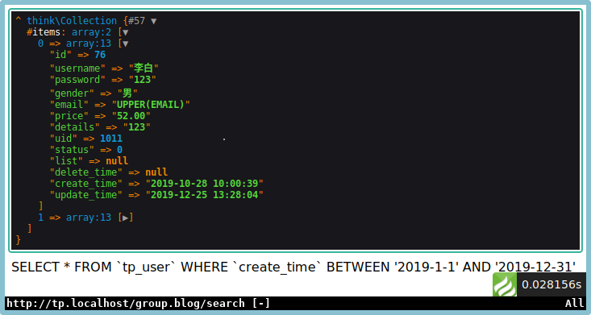

# thinkphp 6.0


## 开发规范及目录结构
### 命名规范
1. 遵循psr-2命名规范和psr-4自动加载
1. 目录和文件的命令规范
    - 目录名:小写+下划线
    - 类库和函数文件以.php为扩展名
    - 类的文件名均以空间定义,并且命名空间的路径和类库文件所在的路径一致
    - 类文件采用帕斯卡命名法(大驼峰),其它彩用小写+下划线命名
    - 类名和文件名操持一致,统一采用帕斯卡命名法
1. 函数和类及属性命名规范
    - 类的名称采用帕斯卡命名法,如:User UserType
    - 函数的命名采用下划线命名法,如:get_user_id;
    - 方法彩用驼峰法,如:getUserId;
    - 属性采用驼峰法,如:tableName;
    - 特例使用双划线\_\_打头函数或者方法作用魔术方法,如:\_\_call \_\_autoload;
1. 常量和配置的规范
    - 常量以大写字母和下划线命名,如APP_PATH;
    - 配置参数以小写字母和下划线命名,如:url_convert;
    - 环境变量定义全用大写字母和下划线,如:APP_DEBUG;
1. 数据表和字段的规范
    - 数据表和字段采用小写+下划线;
    - 字段不用驼峰和中文做为表名和字段名

### 目录结构
1. TP6支持多应用模式,app是应用目录
1. 默认情况下,彩用单模式,结构如下:
```shell
thinkphp
├── app
│   ├── AppService.php
│   ├── BaseController.php
│   ├── common.php
│   ├── controller
│   ├── event.php
│   ├── ExceptionHandle.php
│   ├── middleware.php
│   ├── provider.php
│   ├── Request.php
│   └── service.php
├── composer.json
├── composer.lock
├── config
│   ├── app.php
│   ├── cache.php
│   ├── console.php
│   ├── cookie.php
│   ├── database.php
│   ├── filesystem.php
│   ├── lang.php
│   ├── log.php
│   ├── middleware.php
│   ├── route.php
│   ├── session.php
│   ├── trace.php
│   └── view.php
├── extend
├── LICENSE.txt
├── log.md
├── public
│   ├── favicon.ico
│   ├── index.php
│   ├── robots.txt
│   ├── router.php
│   └── static
├── README.md
├── route
│   └── app.php
├── runtime
├── think
├── vendor
│   ├── autoload.php
│   ├── bin
│   ├── composer
│   ├── league
│   ├── psr
│   ├── services.php
│   ├── symfony
│   └── topthink
└── view
    └── README.md
```

## 安装及配置
### 安装
```shell
 composer create-project topthink/think=6 thinkphp
```
### nginx配置
```vim
// /etc/nginx/site-availabel/tp.localhost.conf
server { listen       80;
	server_name  tp.localhost;
	root   /www/thinkphp/public;
	location / {
	    index  index.html index.htm index.php;
	}
	error_page   500 502 503 504  /50x.html;
	location = /50x.html {
	    root   /usr/share/nginx/html;
	}
	include php74.conf;
```

### 测试命令
```shell
php think run 
```
### 调试模式
1. 复制.example.env为.env文件
```shell
cp .example.env .env
```
2. 将.env文件换行符替换为linux
```vim
// vim .env
// ^M为ctrl+v ctrl+m
:%s/^M/\r/g 
// 检查APP_DEBUG配置
APP_DEBUG = true
```

### 配置信息
1. /.env文件,用于本地配置,部署后会被忽略    
获取配置方式:
```php
use think\facade\Env;
return Env::get('databse.hostname');
```
1. /config文件,用于线上部署
获取配置方式:
```php
use think\facade\config
return Config::get('database.connections.mysql.hostname');
```
1. 本地环境.env文件的优先级会高于config,生产环境.env会被忽略

### url访问模式
1. url解析
    - 多应用: http://serverName/index.php/应用/控制器/操作/参数/值...;
    - 单应用: http://serverName/index.php/控制器/操作/参数/值...;
    - TP6默认是单应用模式,多应用需要作为扩展安装;
1. 兼容模式    
如果不支持url重写,可以用http://serverName/?r=控制器/操作/参数/值来访问.


## 控制器
### 控制器定义
控制器文件存放在controller目录下.
1. 如果改变系统默认的控制器文件目录,可以在config下的router.php配置,如:
```php
'conftoller_layer' => 'controller2',
```
1. 类名和文件名大小写要保持一致,帕斯卡命名
1. 双字母组合的类名,比如class Helloworld访问URL如下:
    - http://localhost/helloworld
    - http://localhost/hello_world
1. 为了避免引入同类名的冲突,可以在route.php设置控制器后缀,那么控制器的命名需要在类名后Controller,比如Test.php-->TestController.php:
```php
'controller_suffix' => true;
```
### 渲染输出
1. ThinkPHP直接采用方法内return的方式输出;
2. json输出,直接采用json函数:
```php
$data = array('a' => 1,'b' => 2,'c' =>3);
return json ($data);
```
3. 避免使用die exit等php方法中断代码,推荐使用助手函数halt();
```php
halt('中断测试');
```
### 基础  多级控制器
1. 基础控制器
    - 创建控制器后,推荐继承基础控制器来获得更多的方法;
    - 基础控制器提供了控制器验证功能,并注入了think\App和think\Request;
1. 空控制器    
在单应用模式下,可以定义一个Error控制器类,来提醒错误:
```php
class ErrorContoller{
    public function index(){
        return 'ErrorContoller:当前控制器不存在!';
    }
}
```
1. 多级控制器    
多级控制器就是在控制器controller目录下再建立目录并创建控制器,例:    
在controller目录建立group目录,并创建BlogController.php控制器,访问的地址为:http://localhost/group.blog
```php
namespace app\controller\group;
use app\BaseController;
class BlogController extends BaseController{
    public function index(){
        echo "group.blog.index";
    }
}
```

## 数据库与模型
### 连接数据库
1. ThinkPHP采用数据抽象层,基于PDO式
1. 修改/config/database.php可以设置连接信息
1. 本地测试,会优先采用.env的配置信息

### 数据库的数据查询
1. 单数据查询
    - Db::table()中table必须指定完整数据表名(包括前缀)
    - 如果希望只查询一条数据,可以使用find()方法,需要指定where条件:
    ```php
    Db::table(`tp_user`)->where('id',27)->find()
    ```
    - Db::getLastSql()方法,可以得到最近一条SQL查询的原生语句
    - 没有查询到任何值,返回null
    - 使用findOrFail()方法同样可以查询一条数据,在没有数据时抛出一个异常:
    ```php
    Db::table('tp_user')->where('id',1)->findOrFail()
    ```
    - 使用findOrEmpty()方法也可以查询一条数据,但在没有数据时返回一个空数组:
    ```php
    Db::table('tp_user')->where('id',1)->findOrEmpty()
    ```
1. 数据集查询
    - 想要获取多列数据,可以使用select()方法
    ```php
    Db::table('tp_user')->select();
    // SELECT * FROM `tp_user`;
    ```
    - 多列数据在查询不到任务数据时,返回空数组,使用selectOrFail()抛出异常:
    ```php
    Db::table('tp_user')0>where('id',1)->selectOrFail();
    ```
    - 在select()方法后使用toArray(),可以将数据集对象转换为数组
    ```php
    $user = Db::table('tp_user')->select->toArray();
    $halt($user);
    ```
    - 当在数据库配置文件中设置了前缀,可以使用name()方法忽略前缀:
    ```php
    Db::name('user')->where('id',27)->value('username');
    ```
1. 其它查询
    - 通过value()方法可以查询单个指定字段的值,没有数据返回null;
    ```php
    Db::name('user')->where('id',27)->value('username');
    ```
    - 通过colunm()方法可以查询多个指定字段的列,没有数据返回空数组:
    ```php
    Db::name('user')->column('username');
    //指定id做为列的索引
    Db::name('user')->column('username','id');
    ```
    - 处理大数据时,为避免内存处理大量数据,可以使用chunk()分批处理数据:
    ```php
    Db::name('user')->chunk(3,function($users){
      foreach($users as $user){
          dump($user);
      }
      echo "单次读取结束<br>";
      echo '====================================';
    });
    ```
    结果如下:    
    
    - 游标查询功能可以大幅度减少少量数据的内存开销,它利用了PHP生成器我,每次查询只读取一行,再次读取时,自动定位到下一行继续:
    ```php
    $cursor = Db::name('user')->cursor();
    foreach($cursor as $user){
        dump($user);
    }
    ```
    结果如下:    
    
1. 链式查询
    1. 查询规则
        - 通过指向符号'->'多次连续调用方法称为:链式查询    
        当通过Db::name('user')查询时,返回一个Query对象,可以连续使用数据库对应方法.当每次执行一个数据库查询方法时,比如(where),返回的还是查询对象,只要是数据库对象,那么可以一直使用指向符号进行链式查询.
        - 当通过find()select()等结果查询方法返回数组(Array)或者数据集对象(Colletigon)时,不可再使用链式查询
        - 除了查询方法可以使用链式操作,CURD也可以使用
    1. 更多查询   
        - 如果多次使用数据库查询,篛次静态创建都会生成一个对象,我们可以把对象实例保存下来,再进行反复调用即可
        ```php
        $userQuery = Db::name('user');
        $dataFind = $userQuery->where('id',27)->find();
        $dateSelect = $userQuery->select();
        ```
        - 当同一个对象实例第二次查询后,会保留第一次查询的值
        ```php
        $data1 = $userQuery->order('id','DESC')->select();
        $data2 = $userQuery->select();
        return Db::getLastSql();
        // SELECT * FROM `tp_user` ORDER BY `id` DESC;
        ```
        使用removeOption可以清除上一次的查询条件
        ```php
        $userQuery->removeOption()->select();
        ```

### 数据新增
1. 新增单条数据    
    1. 使用insert()方法可以向表添加一条数据,有默认值的字段可以不添加
    ```php
    $data = [
        'username' => '洋哥',
        'password' => 'mrcookie',
        'gender' => 'male',
        'email' => 'mrcookie@localhost',
        'price' => 90,
        'details' => '',
    ];
    Db::name('user')->insert($data);
    ```
    1. 如果添加成功,insert()方法会返回一个影响行数(此处为1),如果添加一个不存在的字段数据,会抛出一个异常Exception.如果想强行添加,抛弃不存在的字段数据,可以使用strick(false)方法,忽略异常:
    ```php
    Db::name('user')->stice(false)->insert($data);
    ```
    1. mysql数据库,可以支持replace操作:
    ```php
    $data = [
         'username' => '洋哥',
         'password' => 'mrcookie',
         'gender' => '女',
         'email' => 'mrcookie@localhost',
         'price' => 50,
         'details' => '',
    ];
    Db::name('user')->replace()->insert($data);
    return Db::getLastSql();
    ```
    结果:    
    ```sql
    REPLACE INTO `tp_user` SET `username` = '洋哥' , `password` = 'mrcookie' , `gender` = '女' , `email` = 'mrcookie@localhost' , `price` = '50' , `details` = ''
    ```
    1. 使用insertGetID()方法,可以返回新增数据的id;
    ```php
    Db::name('user')->insertGetID($data);
    ```

1. 批量添加数据
    1. 使用insertAll()方法可以批量新增数据,但要保持数组结构一致:
    ```php
    $data = [
        [
            'username' => '洋嫂',
            'password' => 'mrcookie',
            'gender' => '女',
            'email' => 'mrcookie@localhost',
            'price' => 50,
            'details' => '',
        ],
        [
            'username' => '洋姐',
            'password' => 'mrcookie',
            'gender' => '女',
            'email' => 'mrcookie@localhost',
            'price' => 50,
            'details' => '',
        ]
    ];
    return Db::name('user')->insertAll($data);
    ```
    返回是被影响的行数.
    2. insertAll()也支持replace()方法
    ```php
    Db::name('user')->replace()->insertAll($data);
    return Db::getLastSql();
    ```
    执行结果:    
    ```sql
    REPLACE INTO `tp_user` (`username` , `password` , `gender` , `email` , `price` , `details`) VALUES ( '洋嫂','mrcookie','女','mrcookie@localhost','50','' ) , ( '洋姐','mrcookie','女','mrcookie@localhost','50','' )
    ```
1. save()方法
    1. save()方法是一个通用方法,可以自行判断是新增还是修改(更新)数据.方法根据是否存在主键来判断是否新增.
    ```php
    Db::name('user')->save($data);
    return Db::getLastSql();
    ```
    当不存在主键时:
    ```SQL
    INSERT INTO `tp_user` SET `username` = '洋叔' , `password` = 'mrcookie' , `gender` = '男' , `email` = 'mrcookie@localhost' , `price` = '50' , `details` = ''
    ```
    当存在主键时:
    ```SQL
    UPDATE `tp_user` SET `username` = '洋叔' , `password` = 'mrcookie' , `gender` = '男' , `email` = 'mrcookie@localhost' , `price` = '50' , `details` = '' WHERE `id` = 309
    ```

### 数据的修改删除
1. 数据修改
    1. 使用update()方法来修改数据,修改成功返回影响行数,没有修改返回0:
    ```php
    $data = [
        'username' => '关云长'
    ];
    return Db::name('user')->where('id',38)->update($data);
    ```
    如果数据包含了主键信息,可以省略掉where条件:
    ```php
    $data = [
        'username' => '关云长',
        'id' => 312
    ];
    return Db::name('user')->update($data);
    ```
    1. 使用exp()方法,可以让一些字段执行SQL函数:
    ```php
    Db::name('user')->where('id',307)->exp('email','UPPER(email)')->update();
    ```
    1. 自增/自减某个字段,使用inc/dec方法,支持自定义步长:
    ```php
    Db::name('user')->where('id',304)->inc('price')->dec('status',2)->update();
    ```
    1. raw()方法可以更灵活的处理数据更新
    ```php
    Db::name('user')
        ->where('id',304)
        ->update([
            'email'     =>      Db::raw('UPPER(email)'),
            'price'     =>      Db::raw('price +1'),
            'status'    =>      Db::raw('status -2')
        ]);
    ```
    1. 使用save()方法进行修改数据,必须指定主键才能实现修改功能:
    ```php
    Db::name('user')->where('id',304)->save(['username' = '洋弟']);
    ```
1. 数据删除
    1. 根据主键删除一条记录,如果成功返回影响行数,否则为0:
    ```php
    Db::name('user')->delete(21);
    ```
    1. delete()可删除多个数据:
    ```php
    Db::name('user')->delete([304,305,306]);
    ```
    1. 可以通过where()方法来筛选删除:
    ```php
    Db::name('user')->where('id',303)->delete();
    ```
    1. true参数可以清除表所有数据:
    ```php
    Db::name('user')->delete(true);
    ```

### 数据查询
1. 比较查询
    查询表达式支持大部分常用的SQL请问,格式如下:
    ```php
    where('字段名','查询表达式','查询条件');
    ```
    在查询数据进行筛选时,采用where()方法,比如id=80:
    ```php
    Db::name('user')->where('id',80)->find();
    Db::name('user')->where('id','=','80')->find();
    ```
    使用<> > < >= <=可以筛选出各种符合比较值的数据列表:
    ```php
    Db::name('user')->where('id','<>',80)->select();
    ```
1. 区间查询
    1. 使用like表达式进行模糊查询
    ```php
    Db::name('user')->where('email','like','xiao%')->select();
    return Db::getLastSql();
    ```
    1. like表达式还支持数组传递进行模糊查询
    ```php
    Db::name('user')->where('email','like',['xiao%','wu%'])->select();
    return Db::getLastSql();
    ```
    结果:
    ```SQL
    SELECT * FROM `tp_user` WHERE (`email` LIKE 'xiao%' AND `email` LIKE 'wu%')
    ```
    添加第4个参数以后:
    ```php
    Db::name('user')->where('email','like',['xiao%','wu%'],'or')->select();
    return Db::getLastSql();
    ```
    结果:
    ```SQL
    SELECT * FROM `tp_user` WHERE (`email` LIKE 'xiao%' OR `email` LIKE 'wu%')
    ```
    1. like表达式具有两个快捷方式whereLike()和whereNotLike();
    ```php
    //实际运行中,只会返回第一个return
    Db::name('user')->whereLike('email',['xiao%','wu%'])->select();
    return Db::getLastSql();
    Db::name('user')->whereLike('email',['xiao%','wu%'],'or')->select();
    return Db::getLastSql();
    Db::name('user')->whereNotLike('email',['xiao%','wu%'])->select();
    return Db::getLastSql();
    Db::name('user')->whereNotLike('email',['xiao%','wu%','or'])->select();
    return Db::getLastSql();
    ```
    结果:
    ```sql
    SELECT * FROM `tp_user` WHERE (`email` LIKE 'xiao%' AND `email` LIKE 'wu%')
    SELECT * FROM `tp_user` WHERE (`email` LIKE 'xiao%' OR `email` LIKE 'wu%')
    SELECT * FROM `tp_user` WHERE (`email` NOT LIKE 'xiao%' AND `email` NOT LIKE 'wu%')
    SELECT * FROM `tp_user` WHERE (`email` NOT LIKE 'xiao%' OR `email` NOT LIKE 'wu%')
    ```
    1. like表达式具有两个快捷方式whereBetween()和whereNotBetween();
    ```php
    Db::name('user')->where('id','between','10,25')->select();
    Db::name('user')->where('id','between',[19,25])->select();
    Db::name('user')->whereBetween('id',[19,25])->select();
    Db::name('user')->whereNotBetween('id',[19,25])->select();

    ```
    结果:
    ```SQL
    SELECT * FROM `tp_user` WHERE `id` BETWEEN 10 AND 25
    SELECT * FROM `tp_user` WHERE `id` BETWEEN 19 AND 25
    SELECT * FROM `tp_user` WHERE `id` BETWEEN 19 AND 25
    SELECT * FROM `tp_user` WHERE `id` NOT BETWEEN 19 AND 25
    ```

1. exp查询    
    1. 使用exp可以自定义字段后的SQL语句:
    ```php
    Db::name('user')->where('id','exp','IN(19,21,25)')->select();
    return Db::getLastSql
    ```
    结果:    
    ```SQL
    SELECT * FROM `tp_user` WHERE ( `id` IN(19,21,25) )
    ```
    或者使用whereExp()表达式:
    ```php
    Db::name('user')->whereExp('id','IN(19,21,25)')->select();
    return Db::getLastSql
    ```
1. 时间查询
    1. 传统查询
        - 使用 > < >= <= 来筛选匹配时间的数据
        ```php
        $user = Db::name('user')->where('create_time','>','2018-1-1')->select();
        dump($user);
        return Db::getLastSql()
        ```
        结果:    
        
        - 使用between关键字来查询
        ```php
        $user = Db::name('user')->where('create_time','between',['2019-1-1','2019-12-31'])->select();
        dump($user);
        return Db::getLastSql()
        ```
        结果:    
        
        ```php
        $user = Db::name('user')->where('create_time','not between',['2019-1-1','2019-12-31'])->select();
        dump($user);
        return Db::getLastSql()
        ```
        结果:    
            
    1. 快捷查询    
        - whereTime()查询时间,可以使用> < >= <=    
        ```php
        Db::name('user')->whereTime('create_time','>','2018-1-1')->select();
        ```
        - 时间查询也可以使用between和not between:
        ```php
        Db::name('user')->whereBetween('create_time',['2019-1-1','2019-12-31'])->select();
        ```
        - 还可以使用whereBetweenTime()和whereNotBetweenTime():
        ```php
        Db::name('user')->whereBetweenTime('create_time',2019-1-1','2019-12-31')->select();
        ```
    1. 固定查询
        -  查询某年数据
        ```php
        //今年
        Db::name('user')->whereYear('create_time')->select();
        //去年
        Db::name('user')->whereYear('create_time','last year')->select();
        //某年
        Db::name('user')->whereYear('create_time','2016')->select();
        ```
        结果:    
        
        - 查询某月数据
        ```php
        //当月
        Db::name('user')->whereMonth('create_time')->select();
        //上月
        Db::name('user')->whereMonth('create_time','last month')->select();
        //某月
        Db::name('user')->whereMonth('create_time','2016-10')->select();
        ```
        - 查询某gd 数据
        ```php
        //今天
        Db::name('user')->whereDay('create_time')->select();
        //昨天
        Db::name('user')->whereDay('create_time','last day')->select();
        //某天
        Db::name('user')->whereDay('create_time','2016-10-12')->select();
        ```
    1. 其它查询
        - 查询指定时间的数据:    
        ```php
        //两小时以内
        Db::name('user')->whereTime('create_time','-2 hours')->select()
        ```
        结果:    
        
        - 查询两个时间字段内的数据:
        ```php
        Db::name('user')->whereBetweenTimeField('start_time','end_time')->select()
        ```
        结果:    
        
1. 聚合 原生 子查询
    1. 聚合查询
        - 使用count()方法,可以求出数据的数量
        ```php
        Db::name('user')->count();
        ```
        count()可以指定字段,比如有宿舍的uid,不会计算数量
        ```php
        Db::name('user')->count('uid');
        ```
        - 使用max()/min()方法,可以救出字段最大/最小值
        ```php
        Db::name('user')->max('price');
        Db::name('user')->min('price');
        ```
        如果字段为真数值,可以使用false参数进行强制转换
        ```php
        Db::name('user')->max('email',false);
        Db::name('user')->min('email',false);
        ```
        - 使用avg()方法,可以求出数据的平均值
        ```php
        Db::name('user')->avg('price');
        ```
        - 使用sum()方法,可以求出数据的总和
        ```php
        Db::name('user')->sum('price');
        ```
    1. 子查询
        - 基础知识    
        fetchsql()方法,可以设置不执行SQL,而返回SQL语句,默认为true:    
        ```php
        Db::name('user')->fetchSql()->select();
        ```
        结果:    
        ```SQL
        SELECT * FROM `tp_user`;
        ```
        buildsql()方法,直接返回SQL语句,不需要执行select(),并且封闭了括号和双引号:
        ```php
        Db::name('user')->buildSql();
        ```
        结果:    
        ```SQL
        ( SELECT * FROM `tp_user` )
        ```
        - 子查询的实现
        ```php
        $sql = Db::name('two')->field('uid')->where('gender','男')->buildSql();
        $res = Db::name('one')->where('id','exp','IN'.$sql)->select();
        return Db::getLastSql();
        ```
        结果:    
        
        也可以使用闭包方式执行子查询
        ```php
        $res = Db::name('one')->where('id','in',function($query){
            $query->name('two')->where('gender','男')->field('id');
        })->select();
        ```
    1. 原生查询
        - query()方法,可以进行原生查询,适用于读取操作,SQL错误返回false:
        ```php
        Db::query('select * from tp_user');
        ```
        - execute()方法,可以进行原生SQL更新写入等操作,错误返回false;
        ```php
        Db::execute('insert into tp_user(username,password,email,price,details) values("testuser","2222","2222@localhsot",20,"????")');
        ```

### 链式查询方法
1. where()
    - 基础查询
    ```php
    Db::name('user')->where('id','>',70)->select();
    ```
    - 关联数据查询     
    通过键值对匹配
    ```php
    Db::name('user')->where([
        'gender' => '男',
        'price' => 100
    ])->select();
    ```
    结果:    
    
    - 索引数组查询
    通过数组里的数组拼装方式查询
    ```php
    Db::name('user')->where([
        'gender','=','男',
        'price','=','100'
    ])->select();
    ```
    结果:    
    
    - 数组变量查询
    把复杂数组组装后,通过传递变量查询    
    ```php
        $map[]=['gender','=','男'];
        $map[]=['price','in',[60,70,80]];
        $map[]=['status','>=',0];
        $res = Db::name('user')->where($map)->select(); 
        dump ($res);
        return Db::getLastSql();
    ```
    结果:    
    
    - 字符串参数查询
    whereRaw()可以使用字符串进行类似原生where的查询
    ```php
    Db::name('user')->whereRaw('gender="男" AND price IN (60,70,80)')->select();
    ```
    whereRaw()可以使用预处理模式:
    ```php
    Db::name('user')->whereRaw('id=:id',['id'=>19])->select();
    ```
1. field()
    - field()可以指定要查询的字段    
    ```php
    Db::name('user')->field('id,username,email')->select();
    Db::name('user')->field(['id','username','email'])->select();
    ```
    - fiels()可以给指定的字段设置别名
    ```php
    Db::name('user')->field('id,username as name,email')->select();
    Db::name('user')->field(['id','username'=>'name','email'])->select();
    ```
    结果:    
    
    - fieldRaw()方法可以直接给字段设置Mysql函数
    ```php
    Db::name('user')->fieldRaw('id,SUM(price)')->select();
    ```
    - field(true)可以显式的查询所有字段,而不是*
    ```php
    Db::name('user')->field(true)->select();
    ```
    - withoutField()可以排除某个字段
    ```php
    Db::name('user')->withoutField('price,start_time,end_time')->select()
    ```
    - field()方法在新增数据时,可以验证字段的合法性
    ```php
    $data = [
      'username' => '萨尔',
      'password' => '123',
      'gender' => '女',
      'price' => 90,
      'email' => 'thrall@localhost',
      'details' => 'Lok\'tar ogar',
      'age' => 19
    ];
    $res = Db::name('user')->field('username,email,details')->insert($data);
    ```
    结果:    
    

1. alias
    - alias()方法可以给数据库起一个别名
    ```php
    Db::name('user')->alias('a')->select();
    ```
1. limit
    - limit()方法用于限制获取数据的人数
    ```php
    Db::name('user')->limit(5)->select();
    ```
    - 传递两个参数可以实现分页查询,例如从第3条开始显示5个记录limit(2,5)
    ```php
    Db::name('user')->limit(2,5)->select();
    ```
    - 分布显示需要严格计算每页条数及从第几条开始
    ```php
    // 第一页
    Db::name('user')->limit(0,5)->select();
    // 第二页
    Db::name('user')->limit(5,5)->select();
    ```
1. page
    - page()方法,优化了limit()方法,不需要计算分页条数
    ```php
    // 第一页
    Db::name('user')->page(1,5)->select();
    // 第二页
    Db::name('user')->page(2,5)->select();
    ```
1. order
    - order(*)方法可以指定排序方式,第二个参数默认asc
    ```php
    Db::name('user')->order('id','desc')->select();
    ```
    - 可以使用数组对多个字段进行排序
    ```php
    Db::name('user')->order([
        'create_time' => 'desc',
        'price' => 'asc'
    ])->select();
    ```
    - 使用orderRaw()方法可以在排序的时候指定Mysql函数
    ```php
    Db::name('user')->orderRaw('FIELD(username,"樱桃小丸子") DESC')->select();
    ```
1. group 
    group()方法,例:给不同性别的人进行price字段的总和统计
    ```php
    Db::name('user')->fieldRaw('gender',SUM(price))->group('gender')->select();
    ```
1. having
    group分组后,可以使用having进行筛选
    ```php
    Db::name('user')->fieldRaw('gender,SUM(price) as sum')->group('gender')->having('sum > 500')->select();
    ```

### 数据库的高级查询

1. 使用|(or)或者&(AND)来实现where条件的高级查询
    ```php
    $user = Db::name('user')
        ->where('username|email','like','xiao%')
        ->where('price&uid','>',0)
        ->select();
    dump($user);
    Db::getLastSql();
    ```
    结果:    
    

1. 关联数组可以在where进行多个字段进行查询
    ```php
    $user = Db::name('user')->where([
        ['id','>',0],
        ['status','=','1'],
        ['price','>=',80],
        ['email','like','%163%']
    ])->select();
    dump($user);
    return Db::getLastSql();
    ```
    结果:    
    
    如果使用exp关键字,需要使用raw()方法
    ```php
    $user = Db::name('user')->where([
        ['id','>',0],
        ['status','=','1'],
        ['price','exp',Db::raw('>80')],
        ['email','like','%163%']
    ])->select();
    dump($user);
    return Db::getLastSql();
    ```
    结果:    
    
1. 当where条件为$map数组,并且要用第2个where去匹配前面的结果的话,要注意为$map数组加上中括号.    
修改前:    
    ```php
    $map = [
        ['id','>',0],
        ['price','>=',80],
        ['email','like','%163%']
    ];
    $user =  Db::name('user')
        ->where($map)
        ->where('status',1)
        ->select();
    ```
    结果:    
        
    修改后:    
    ```php
    $map = [
        ['id','>',0],
        ['price','>=',80],
        ['email','like','%163%']
    ];
    $user =  Db::name('user')
        ->where([$map])
        ->where('status',1)
        ->select();
    ```
    结果:    
        

1. 多个条件数组并且需要OR来筛选,可以用whereOr()
    ```php
    $map1 = [
        ['username','like','%小%'],
        ['email','like','%163%']
    ];
    $map2 = [
        ['username','like','%孙%'],
        ['email','like','%.com']
    ];
    $user = Db::name('user')
        ->whereOr([$map1,$map2])
        ->select();
    dump($user);
    return Db::getLastSql();
    ```
    结果:    
    

1. 闭包查询可以连缀,如果是or查询请使用whereor()
    ```php
    $user = Db::name('user')
        ->where(function($query){
            $query->where('id','>',0);
        })
        ->where(function($query){
            $query->where('status > 0');
        })
        ->whereOr('username','like','%小%')
        ->select();
    dump($user);
    return Db::getLastSql();
    ```
1. 对于比较复杂的SQL,__where__条件可以直接使用whereRaw()方法
    ```php
    $user = Db::name('user')
        ->whereRaw('(username LIKE "%小%" AND email LIKE "%163%") OR (price > 80)')
        ->select();
    dump($user);
    return Db::getLastSql();
    ```

### 数据库的快捷查询
1. 框架封装了很多where方法,全部如下:
| 方法            | 解释                 |
|-----------------|----------------------|
| whereOr         | 字段的OR查询         |
| whereXor        | 字段的Xor查询        |
| whereNull       | 查询字段是否为null   |
| whereNotNull    | 查询字段是否不为null |
| whereIn         | 字段IN查询           |
| whereNotIn      | 字段NOT IN查询       |
| whereBetween    | 字段BETWEEN查询      |
| whereNotBetween | 字段NOT BETWEEN查询  |
| whereLike       | 字段LIKE查询         |
| whereNotLike    | 字段NOT LIKE查询     |
| whereExists     | EXISTS条件查询       |
| whereNotExists  | NOT EXISTS条件查询   |
| whereExp        | 表达式查询           |
| whereColumn     | 比较两个字段         |

1. whereColumn()方法
    比较两个字段的值    
    ```php
    $user = Db::name('user')
        ->whereColumn('update_time','>=','create_time')
        ->select();

    //时间比较可以省略默认'>='操作符
    $user = Db::name('user')
        ->whereColumn('update_time','create_time')
        ->select();
    ```
    结果:     
    
1. whereFieldName()方法,查询某个字段的值(FieldName为字段名!!)
    ```php
    Db::name('user')->whereEmail('xiaoxin@163.com')->find();
    Db::name('user')->wherePassword('123')->select();
    //下划线字段要采用驼峰式写法,比如create_time
    Db::name('user')->whereCreateTime('2016-06-27 16:45:26')->select();
    ```
1. getByFieldName()方法,查询某个字段的值.__该方法只能查询一条,不需要find()方法__.
    ```php
    Db::name('user')->getByEmail('xiaoxin@163.com');
    ```
 
### 数据库事务
1. 事务处理
    - 自动处理
        ```php
        Db::transaction(function(){
            Db::name('user')->where('id',19)->save(['price'=>DbRaw('price -3')]);
            Db::name('user')->where('id',20)->save(['price'=>DbRaw('price +3')]);
        });
        ```
    - 手动处理
        ```php
        Db::startTrans();
        try{
            Db::name('user')->where('id',19)->save(['price'=>Db::raw('price -3')]);
            Db::name('user')->where('id',20)->save(['price'=>Db::raw('price +3')]);
            Db::commit();
        }catch(\Exception $e){
            echo "事务执行失败!";
            Db::rollback();
        }

        ```
### 获取器    
    在获取数据列表的时候,对获取的字段进行处理
    ```php
    //withAttr两个参数,第一个为要处理的字段名,第二个参数为要处理的匿名函数
    //匿名函数有两个实参,第一个为所处理的字段数据,第一个是所处理的一行数据
    //匿名函数返回为处理过的字段数据
    $user = Db::name('user')->withAttr('email',function($value,$data){
        return strtoupper($value);
    })->select();
    ```
### 数据集
    数据库查询后如果不加方法的话,返回的是一个collection数据集对象,那么可以对这个数据集对象进行处理,比如常见的toArray()等,具体方法可以查看手册.

## 模型
### 模型的定义
1. 模型的名称和数据库表名匹配,模型会自动对应数据表.
    ```php
    use think\model;
    class User extends Model{}
    ```
1. 模型类需要去除表前缀(tp_),采用帕斯卡命名法
    - tp_user => User
    - tp_user_type => UserType
1. 如果要设置应用类后缀,比如UserModel
    1. 更改文件名和类名
    1. 设置$name私有属性为表名

    ```php
    //UserModel.php
    class UserModel extends model{
        protected $name = 'user';
    }
    ```

### 模型的设置
1. 避免类名重复,可以设置别名
```php
use app\model\User as UserModel;
```
1. 在模型中可以设置其它的数据表
```php
protected $table = 'tp_one';
```
1. 模型可以初始化,只需要设置init静态方法

```php
protected static function init(){
    //第一次实例化后执行
    echo "初始化xxx模型";
}
```
### 模型的CURD
模型的增和改都是save()方法执行的,会自动识别数据来完成.实例化模型后,调用sava()方法就是新增,在查询后再save()或者传入主键就是修改.
#### 增(Create)
1. 实例化方式新增
    - 创建一个Model对象
    ```php
    $user = new UserModel();
    //或者
    $user = new \app\model\User();
    ```
    - 新增一条数据    
    实例化对象后,可以用两种方式新增数据
        1. 设置对象属性新增
        ```php
        $user->username = '地狱咆哮';
        $user->password = '123';
        $user->gender   = '男';
        $user->email    = 'dypx@163.com';
        $user->price    = 100;
        $user->details  = '那叫一个帅';
        $user->uid      = 10010;
        $user ->save();
        ```
        1. 传递数组新增
        ```php
        $data = [
            'username' => '小地狱咆哮',
            'password' => '123',
            'gender'   => '男',
            'email'    => 'dypx@163.com',
            'price'    => 100,
            'details'  => '那叫一个帅',
            'uid'      => 10010,
        ];
        $user -> save($data);
        ```
    - 添加allowField()方法,可以过滤写入参数,但如果有字段未填写并且字段没有默认值会异常
    ```php
    $user = new User();
    $user->username = '不地狱咆哮';
    $user->password = '123';
    $user->gender   = '男';
    $user->email    = 'dypx@163.com';
    $user->price    = 100;
    $user->details  = '那叫一个帅';
    $user->uid      = 10010;           
    $user->allowField(['username','password'])->save(); 

    $data=[
        'username' => '老地狱咆哮',
        'password' => '123',
        'gender'   => '男',
        'email'    => 'dypx@163.com',
        'price'    => 100,
        'details'  => '那叫一个帅',
        'uid'      => 10010,
    ];
    $user ->allowField(['username','password','details'])->save($data);
    ```
    - 通过replace()方法可以实现 replace info
    ```php
    $user->replace()->save(...);
    ```
    - 新增成功后,可以用$user->id来获得ID
    ```php
    echo $user->id;
    ```
    - 使用savaAll()方法,可以指新增数据,返回一个新增的数组
    ```php
    $data=[
        [
            'username' => 'MINI地狱咆哮1',
            'password' => '123',
            'gender'   => '男',
            'email'    => 'dypx@163.com',
            'price'    => 100,
            'details'  => '那叫一个帅',
            'uid'      => 10010,
        ],
        [
            'username' => 'MINI地狱咆哮2',
            'password' => '123',
            'gender'   => '男',
            'email'    => 'dypx@163.com',
            'price'    => 100,
            'details'  => '那叫一个帅',
            'uid'      => 10010,
        ]
    ];
    $user ->saveAll($data);
    ```
1. 静态方法新增
```php
//参数1:新增数据数组
//参数2:过滤字段数组
//参数3:是否replace写入,默认为false
$user  = User::create([
    'username' => 'MINI地狱咆哮3',
    'password' => '123',
    'gender'   => '男',
    'email'    => 'dypx@163.com',
    'price'    => 100,
    'details'  => '那叫一个帅',
    'uid'      => 10010,
],
[
    'username',
    'password',
    'details'
],
false);
echo $user->id;
```

#### 删(Delete)
1. Model对象查找删除
    1. find()方法查询到数据
    ```php
    $user = User::find(310);
    ```
    1. delect()方法删除
    ```php
    $user->delete();
    ```
1. Model对象静态方法删除
    1. 使用destroy()方法,通过主键删除
    ```php
    User::destroy(308);
    ```
    1. 使用destroy()方法,可以批量删除
    ```php
    User::destroy([100,101,102]);
    ```
    1. 使用destroy()方法,可以闭包删除
    ```php
    User::destroy(function($query){
        $query->where('id','>','80');
    });
    ```
1. Model对象通过where查询删除
```php
User::where('id','>','80')->delete();
```

#### 改(Update) 
1. 通过find()方法查找修改
```php    
$user = User::find(308);
$user->username = '洋嫂嫂';
$user->email = 'mrscookie@localhost';
$user->save();
```
1. 通过where()方法查询修改
```php
$user = User::where('username','like','%地狱咆哮%')->find();
$user->username = '哪个地狱咆哮';
$user->save();
```
1. 通过force()方法强制更新    
save()方法如果提交的数据没有变化不会更新,想要强制更新数据,可以使用force()方法
```php
$user->force()->save();
```
1. 数据更新同样支持SQL函数方式
```php
$user->price = Db::raw('price+1');
```
1. 通过allowField()方法过滤更新字段
```php
$user->allowField(['username','email'])->save(...);
```
1. 通过saveAll()方法可以指修改数据    
saveAll()方法,只能通过主键id进行更新,返回被修改的数据集合.
```php
$dataList = [
    ['id'=>315,'username'=>'兽人1号'],
    ['id'=>316,'username'=>'兽人2号'],
    ['id'=>317,'username'=>'兽人3号'],
    ['id'=>318,'username'=>'兽人4号'],
    ['id'=>319,'username'=>'兽人5号'],
];
$user->allowField(['username','email'])->save($dataList);
```
1. 通过静态方法::update()方法更新,返回对象实例
    1. 通过一个含有主键的数组更新
    ```php
    User::update([
        'id' => 314,
        'username' => '那我就叫update'
    ]);
    ```
    1. 通过第二个参数传递主键
    ```php
    User::update([
        'username' => '那我就叫update',
        'email' => 'update@localhost'
    ],
    ['id' => 314]
    );
    ```
    1. 通过第三个参数,来过滤数组
    ```php
    User::update([
        'username' => '这次只更新了用户名',
        'email' => 'dontupdate@localhost'
    ],
    ['id' => 314],['username']
    );
    ```

#### 查(Retrieve)
1. 通过find()方法,查询单条数据
    - 通过主键查询
    ```php
    $user = User::find(129);
    return json($user);
    ```
    - 通过where()条件查询
    ```php
    $user = User::where('username','兽人1号')->find();
    return json($user);
    ```
1. 通过findOrEmpty()方法查询
find()查询如果数据不存在时返回Null,使用findOrEmpty,如果数据不存在返回空模型.此时可以用isEmpty()来判断是否为空.    
```php
$user = User::findOrEmpty(1111);
if($user->isEmpty()){
    echo "数据不存在";
}
```
1. 通过select()方法,查询多少数据
```php
$user = User::select([315,316,317])；
return json($user);
```
1. 查询方法可以使用where()等方法链式查询
1. 通过value()和column()获取某个字段或者列
```php
//查询单条数据的字段
User::where('id',315)->value('username');
//查询多条数据的列
//第一个参数为需要查询的列,第二个参数为键名
User::whereIn('id',[315,316,317])->column('username','id')
```
1. 通过getByXxx动态查询,Xxx表示字段名,只能支持单数据查询
```php
User::getByUsername('兽人1号');
```
1. 通过max()、min()、sum()、count()、avg()等方法聚合查询
```php
User::max('price');
```
1. 通过check()方法分批查询
```php
User::chunk(5,function($user){
    foreach($users as $user){
        echo $user->username."<br>";
    }
    echo '<hr>'；
});
```
1. 通过cursor()方法进行游标查询 
```php
$cusor = User::cursor();
foreach($corsor as $user){
    echo $user->username;
}
```

### 模型的字段设置
模型的数据字段和表字段是对应的,默认会自动获取,包括字段的类型,每次获取都会执行一次查询,如果在模型中配置字段信息,会减少不必要的内存开销
1. 设置模型的$schema字段,可以自定义字段信息
```php
protected $schema = [
    'id' => 'int',
    'username' => 'string',
    'status' => 'int',
    'email' => 'string'
];
```
### 模型的获取器和修改器
#### 获取器
获取器的作用是对模型实例的数据做出处理,获取器对应模型的一个特殊public方法,命名规范为getXxxxAttr().
1. 获取已有字段    
获取User模型的status字段(int),然后输出为中文字符
```php
// 模型文件
public function getStatusAttr($value){
    $status = [-1 =>'删除',0=>'禁用',1=>'正常',2=>'待审核'];
    return $status[$value];
}
// 控制器文件
$user = User::find(19);
return $user->status;
```
1. 获取虚拟字段
```php
// 模型文件
//第二个参数为查询对象,类型为数组
public function getLevAttr($value,$arr){
    if($arr['price']>50){
        return '大款';
    }else{
        return '屁民';
    }
}
// 控制器文件
$user = User::find(19);
return $user->lev;
```
1. 设置了获取器以后,想要得到原始结果可以用getData()方法
    - 获取status原生数据
    ```php
    // 控制器文件
    $user = User::find(19);
    return $user->getData('status');
    ```
    - 获取模型原始数据
    ```php
    // 控制器文件
    $user = User::find(19);
    return json($user->getData());
    ```
1. 在控制器端可以使用withAttr()实现动态获取器
```php
// 注意: 新版本提示WithAttr不是一个静态方法,所以不可以像示例一样加在模型的后面    
//       只能在find()或者select()以后,返回一个对象之后使用
$userList = User::select()->WithAttr('status',function($val){
    $arr = [-1 =>'删除',0=>'禁用',1=>'正常',2=>'待审核'];
    if(isset($arr[$val])){
        return $arr[$val];
    }else{
        return '错误的状态值';
    }
});
foreach($userList as $user){
    echo $user->username.'=>'.$user->status.'<br>';
}
```
__注意:__    
> 如果同时定义了模型获取器和控制器动态获取器,那么动态获取器的优先级更高    

#### 模型修改器    
模型修改器的作用是对模型设置对象的值进行处理,在数据进行新增和修改的时候会触发修改器,命名规则为setXxxxAttr()
```php
//新增或者修改数据时把邮箱改为大写
public function setEmailAttr($val){
    return strtoupper($val);
}
```
### 模型的查询范围
查询范围是模型的查询或者写入方法的封闭,方便控制器端调用.命名规则为scopeXxxx(),xxxx调用时直接作为参数使用.    
1. 普通查询
例如,要查询性别为男的用户:
```php
// 模型
public function scopeMale($queryObj){
    return $queryObj->where('gender','男')->field('id,username,gender,email');
}
// 控制器
public function scope(){
    // 方法1
    $res = User::scope('male')->select()->toArray();
    // 方法2
    $res = User::male()->select()->toArray();
    dump($res);
}
```
1. 传参查询
```php
// 模型
public function scopeEmail($queryObj,$val){
    $queryObj->where('email','like','%'.$val.'%');
}
// 控制器
$res = User::email('xiao')->select();
return json($res);
```

